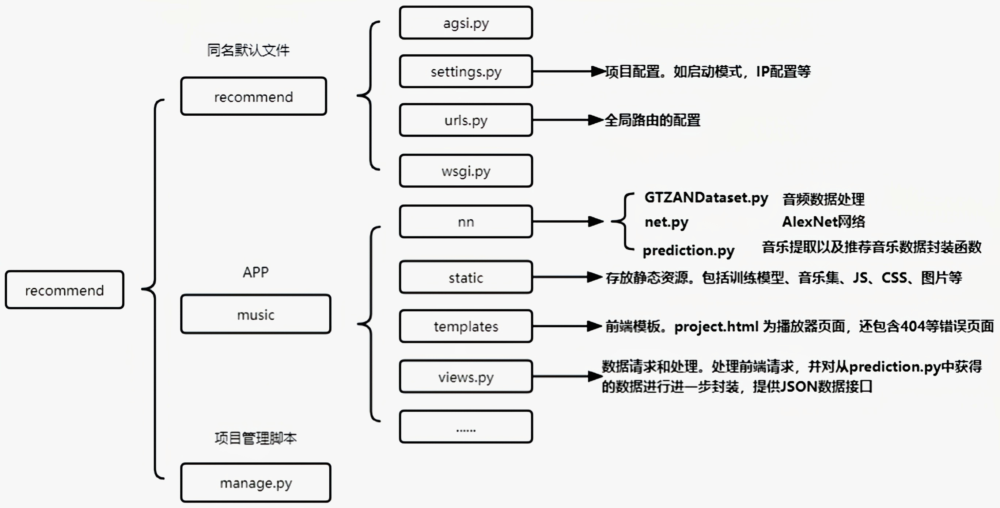
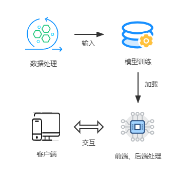
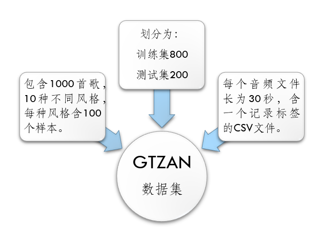
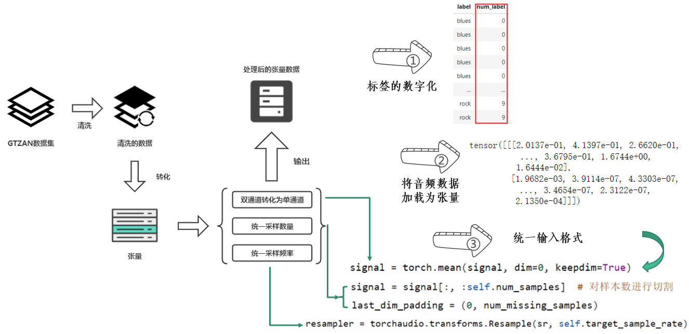
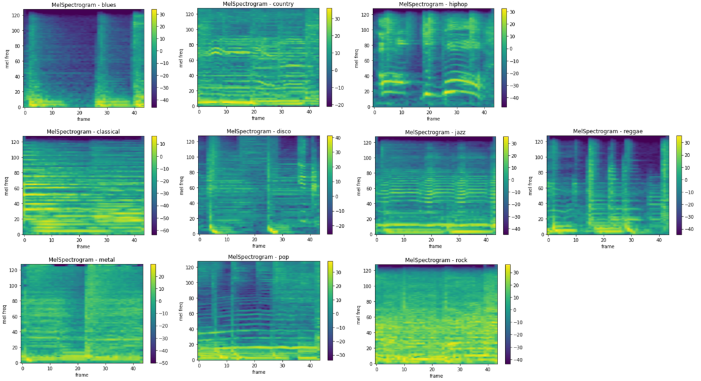
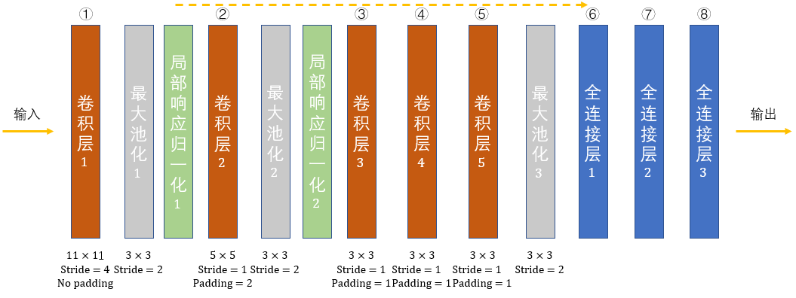
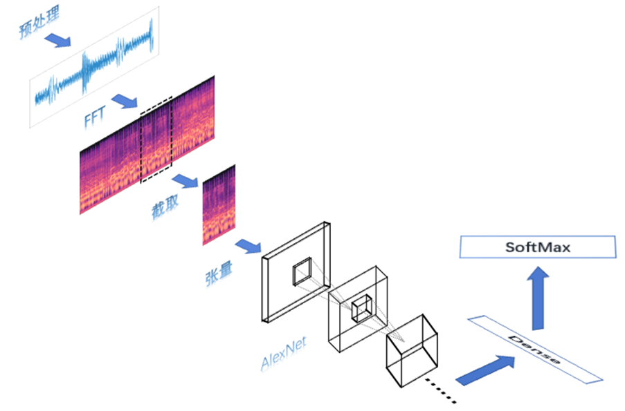
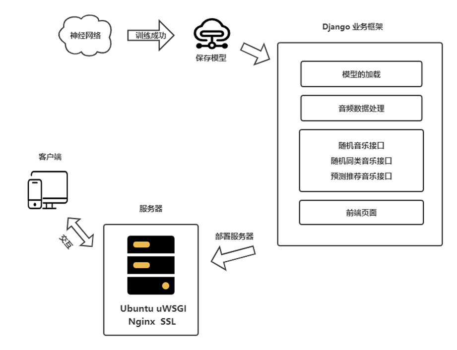

## Music-Recommendation-System

## 写在前面

本作品是我大二参加计算机设计大赛的一个小作品，也是我初步学习神经网络的一个完整作品。在学习以及完成作品中也参考了很多资料以及其他各类项目。本项目仅供大家学习，欢迎大家留言与我交流。

## 代码结构

本项目整体的代码框架如下所示: 

  

  代码框架

### 设计结构

如下所示为整个项目的运行流程图: 

 

  整体流程

### 数据处理

需要对标签数据清洗以及将音频信号转化为频谱信号。本次数据集采用公开音频数据集GTZAN，其中包含了10种不同风格的音乐，每一种音乐都包含100个音频文件，每个音频文件都是30秒。

  数据集介绍

在本项目中我们需要将音频信号转化为频谱信号，本项目将其转化为梅尔频谱，直接使用pytorch的torchaudio中的函数即可快速转化。

  数据处理流程

- 将音频信号转化为梅尔频谱

  梅尔频谱图是将频率转换为梅尔刻度的频谱图。使用梅尔频谱可以起到压缩数据、数据拥有更多的表征能力，同时有论文表明与传统的傅里叶变化相比，转化为梅尔频谱的样本可以提高训练的准确率。

  转化后的梅尔频谱

### 神经网络

本项目选用卷积神经网络AlexNet。一个是对于初学者有较好较多的学习点，另一个是网络比较简单，对于这个小样本集有比较良好的效果。

- AlexNet 的网络结构

  AlexNet网络结构

- 单样本的训练流程

  样本训练流程

### 音乐推荐系统

使用Django实现推荐系统的功能，提供前后端交互页面。

 推荐系统结构设计

### 如何使用本项目

- **下载数据集**

> [gtzan  | TensorFlow Datasets (google.cn)](https://tensorflow.google.cn/datasets/catalog/gtzan)

- **训练模型**

> 训练模型的代码为Jupyter Notebook格式，可以使用Kaggle来进行训练。
>
> https://www.kaggle.com/  每周大概有40多小时白嫖的GPU时长，无需翻墙，自认为比colab好用一些。

项目文件中的recommend.ipynb 即为训练代码，训练后生成模型参数文件 best_model_okk.pth

- **构建Django前后端**

根目录下 **文件 recommend文件夹 即为 Django 项目，记得将GTZAN数据集文件放在目录recommend/music/static/GTZAN下**

接下来即可使用pycharm启动项目即可

- **项目部署**

  关于项目部署, 可以参考以下文章:

  > [Nginx服务部署_nginx部署_Sq夏颜的博客-CSDN博客](https://blog.csdn.net/weixin_44175418/article/details/124869074?ops_request_misc=%7B%22request%5Fid%22%3A%22169348462016800186597340%22%2C%22scm%22%3A%2220140713.130102334..%22%7D&request_id=169348462016800186597340&biz_id=0&utm_medium=distribute.pc_search_result.none-task-blog-2~all~sobaiduend~default-1-124869074-null-null.142^v93^chatgptT3_2&utm_term=nginx项目部署&spm=1018.2226.3001.4187)

## 可能有用的链接

**前端参考项目**: https://github.com/Ezenlee/WebMusicPlayer

**音频处理学习**: https://www.youtube.com/watch?v=gp2wZqDoJ1Y&list=PL-wATfeyAMNoirN4idjev6aRu8ISZYVWm

